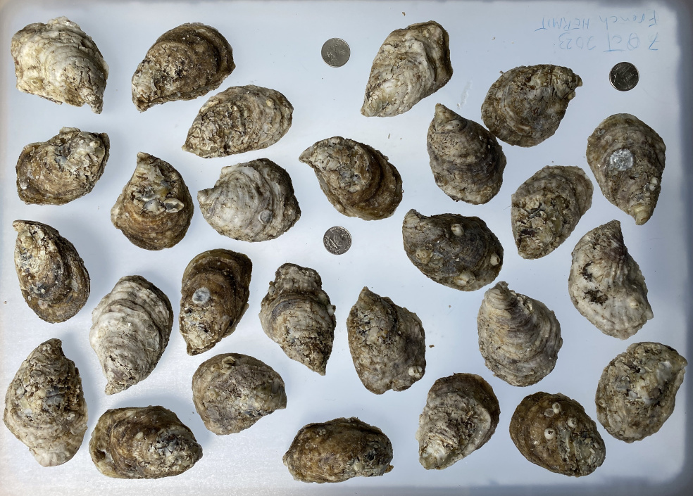
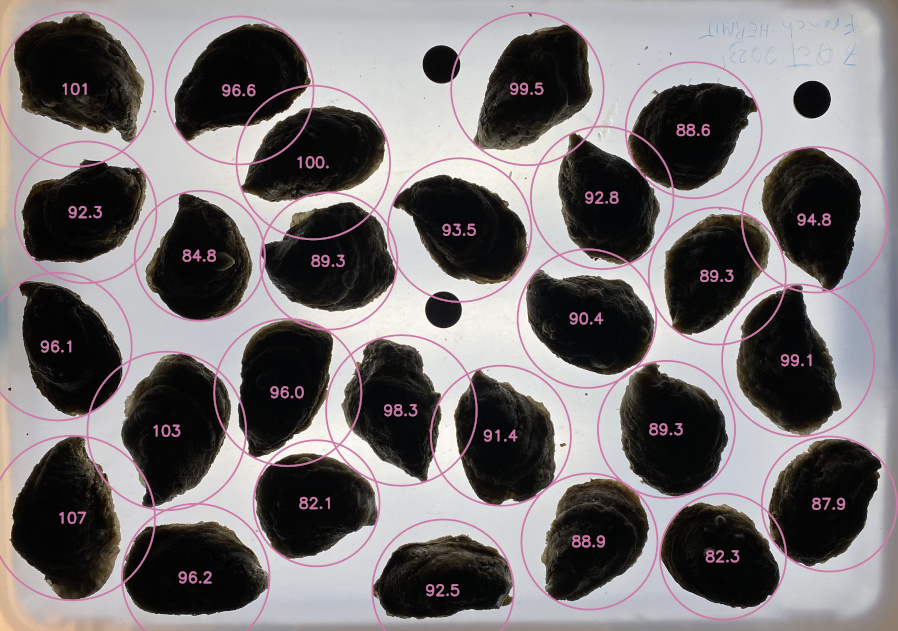
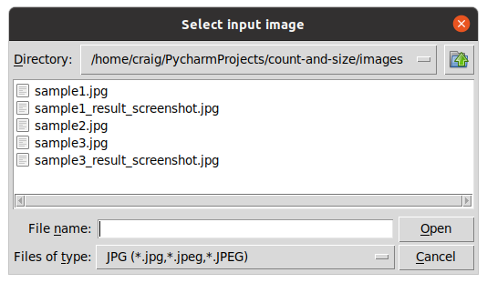
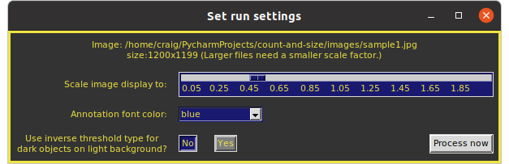
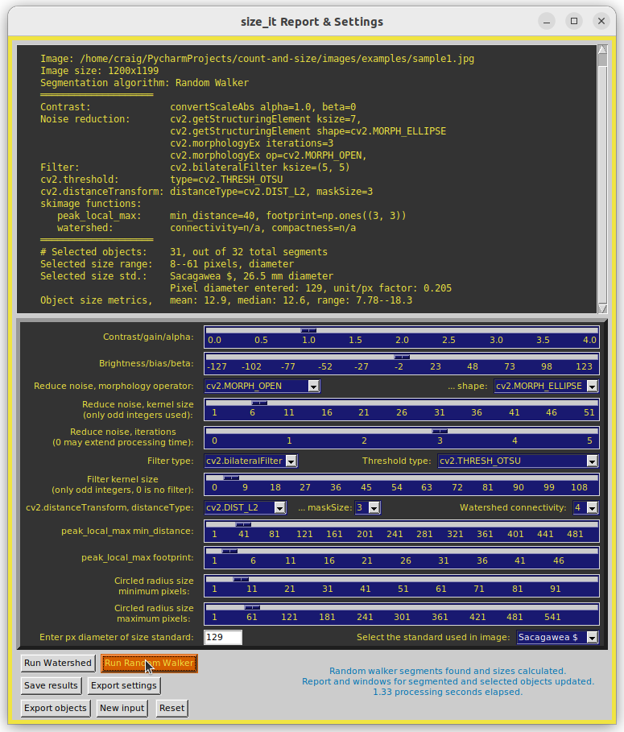
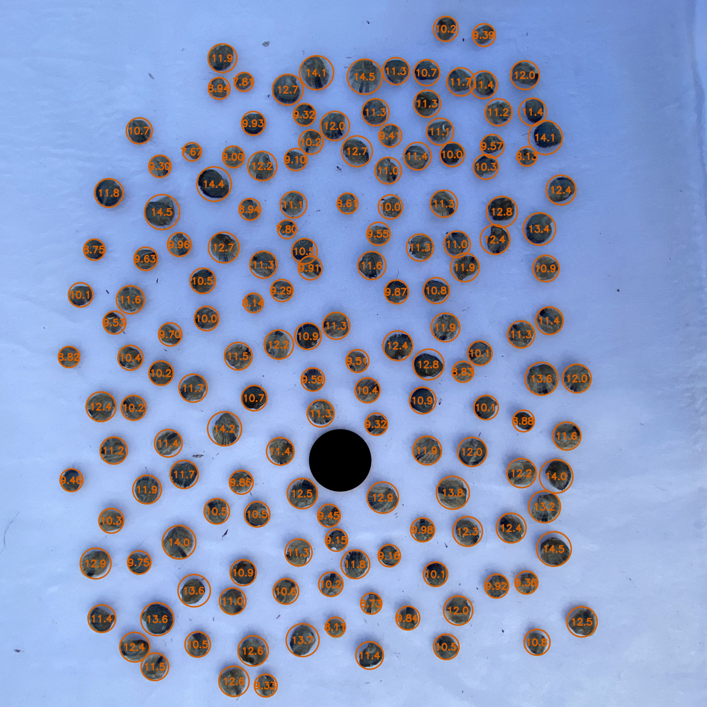
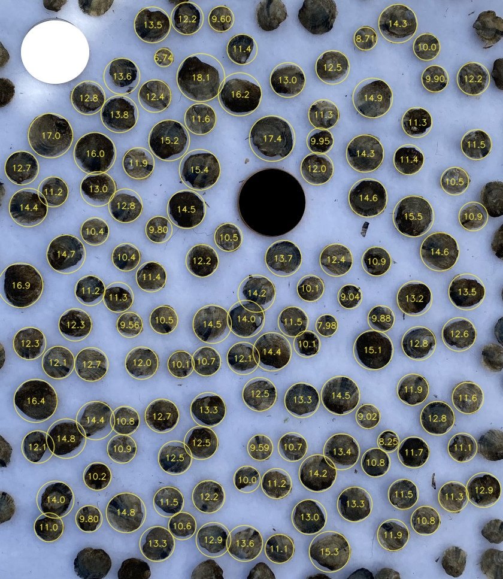
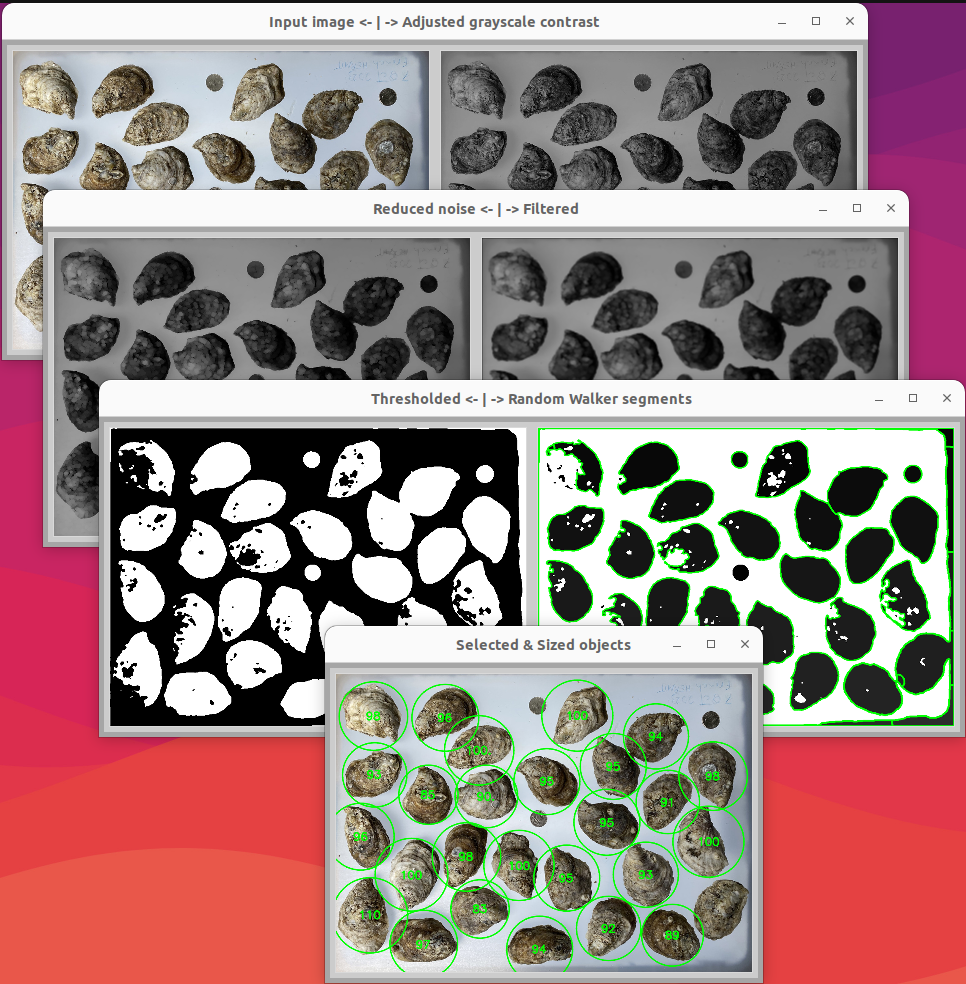

# Project: count-and-size

Farmed oyster population sample (top); the analyzed back lit image, with annotations (bottom), using a U.S. quarter dollar for the size standard. Sample mean was 93.1 mm, n=27.

The interactive Python program, `size_it.py`, is a tkinter GUI for OpenCV processing of an image to obtain sizes, means,
and ranges of objects in a sample population. Distance transform and either
watershed or random walker algorithms are used interactively by setting their parameter
values with slide bars and pull-down menus. Related image preprocessing
factors like contrast, brightness, noise reduction, and filtering are 
also adjusted interactively, with live updating of the resulting images.

A report is provided of parameter settings, object count, individual
object sizes, and sample size mean and range, along with an annotated
image file of labeled objects.

While random walker may provide better object segmentation than watershed for some images, it can increase processing times up to 8-fold; large images with many objects may take several minutes to process. With either segmentation algorithm, interactive processing of counts and sizes is triggered from a Button command instead of the action of individual sliders and pull-downs, as with the preprocessing steps. This approach can save time when you already have some idea about the combination of parameter settings needed.

This Project was developed to sample oyster populations at various stages of aquaculture production, but can be used to measure any sample population of round or oblong objects photographed on a contrasting background. Objects need not all be completely isolated, as touching and slightly overlapping objects can be successfully segmented. When segmentation of objects in large or poorly contrasted overlapping clusters is no possible, such clusters can be screened out by limiting the size range to provide fairly accurate metrics for the remaining well-segmented objects.

Sizing standards are chosen from a pull-down menu. Pre-set standards include a 3-inch hockey puck and various U.S. coins. Sizing units are millimeters when one of the pre-set size standards is used, pixels when not, or determined by the user when using a custom standard. If "None" is chosen as a standard and the pixel diameter entry is kept as 1 (default settings), then displayed sizes are in pixel units. Users have an option for a custom size standard that requires entry of the known size in whatever units are needed.

All modules can be executed on Linux, Windows, and macOS platforms. `size_it.py` is derived from the `contour_it.py` module of the opencv-contour-utils2 GitHub repository.

A text file of object sizes and metrics, parameter settings, and the resulting annotated image file of sized objects, can be saved. 

Project inspired by code from Adrian Rosebrock:
https://pyimagesearch.com/2016/03/28/measuring-size-of-objects-in-an-image-with-opencv/
https://pyimagesearch.com/2015/11/02/watershed-opencv/

The to_precision.py module is from:
https://github.com/BebeSparkelSparkel/to-precision/releases/tag/0.0.0

Development environment was Linux Ubuntu 20.04 (Python 3.8), Windows 11 (Python 3.11), and macOS 13.2 (Python 3.9).

### Usage examples:
From within the downloaded repository folder, recommended command line invocation is : `python3 -m size_it`

To view basic information, author, version, license, etc.: `python3 -m size_it --about`

To have the settings and size report print to the Terminal in addition to saving to file: `python3 -m size_it --terminal` (or can use -t).

As with any Python downloads, running within a virtual environment is recommended.

On Windows systems, you may need to replace 'python3' with 'python' or 'py'.

Be aware that very large image file may require a few seconds to display the image widows, depending on your system performance. Be patient.

The Esc or Crtl-Q key will quit the program once a file is selected. To quit the initial Open file dialog, just close the window in the usual manner.

Sample image files, listed below, are provided in this distribution's `images` directory. From the opening window, users can browse to there or whichever directory contains their image for analysis. Settings and annotated images are saved to the selected image's directory.

Image file examples provided in the `images/examples` folder of this distribution, where sample1 was used to establish default processing parameters:
* sample1.jpg (baby oysters on black burlap, 1200x1199 902 kB),
* sample2.jpg (baby oysters on white, Sacagawea coin edited to black, 2627x2629, 1050 kB),
* sample3.jpg (sample2 cropped, with some oysters out of frame, 540x967, 268 kB)
* sample4.jpg (mature oysters on white, top-lit, used in README figure, 984x705, 363 kB)
* sample5.jpg (sample4 oysters, backlit, 898x630, 77 kB)

### Requirements:
Python 3.7 or later, plus the packages OpenCV-Python, NumPy, scikit-image, SciPy, pyAMG, and tkinter (Tk/Tcl). See Known Issues, below regarding pyAMG.

For quick installation of the required Python PIP packages:
from the downloaded GitHub repository folder, run this command

    pip install -r requirements.txt

Alternative commands (system dependent):

    python3 -m pip install -r requirements.txt (Linux and macOS)
    py -m pip install -r requirements.txt (Windows)
    python -m pip install -r requirements.txt (Windows)

As with all repository downloads, it is good practice to install the required packages in a Python virtual environment to avoid undesired changes in your system's Python library.

### Screenshots:
Most screenshots are from an Ubuntu Linux platform. For Windows and macOS platforms, window and widget look or layout may be different.

Below, initial file selection window. (The *_screenshot.jpg files in the `images` folder are used for this README.)
Currently supported image file types are JPG, PNG, and TIFF.

Once a file is selected, basic run parameters are set in a new pop-up window. The scale slider determines the displayed size of the processed image windows. A scale value is automatically determined based on the size of your selected file, but you can change it as desired. Available annotation colors are: blue, orange, sky blue, blueish green, vermilion, reddish purple, yellow, black, white, red, and green. All but red and green should be suitable for users with deuteranopia. The "INVERSE" selections are for the kind of object vs. background contrast the image has: "No" for light-on-dark, "Yes" for dark-on-light. This determines the initial cv2.threshold type, but can be changed later, if needed, in the main settings.

When the "Process now" is clicked, the main settings and report window appears (below), along with multiple processed image windows. In this analysis, the Sacagawea dollar size standard was selected and its observed pixel diameter of 128 was entered. It was subsequently excluded from the reported object size metrics by reducing the 'Circled radius size maximum' until the coin no longer was annotated with its size (26.5 mm). The standard's pixel diameter of 129 was obtained from the initial result window when initial default settings were used. The report show that 31 object were found, with a mean of 12.9 mm, a median of 12.7 mm, covering a range of 7.70 to 18.5 mm.

Below, the resulting annotated image. Clicking the "Save settings & sized image" button exports the annotated image (at its original resolution), and the settings report, including the 31 individual sizes, to the input image's folder.

Below, resulting annotated image for the input `sample2.jpg` and the text output of its saved settings. Objects were properly segmented by adjusting (from their defaults) the values for contrast, noise reduction, filter, and peak local maximum. Values for the selected size range and standard were then applied.

<pre>
Time saved: 2023/12/06 10:56:28AM
Saved image file: sample2_size_it_20231206105628.jpg
Image: /home/craig/PycharmProjects/count-and-size/images/examples/sample2.jpg
Image size: 2629x2627
Segmentation algorithm: Watershed
════════════════════
Contrast:              convertScaleAbs alpha=1.5, beta=0
Noise reduction:       cv2.getStructuringElement ksize=9,
                       cv2.getStructuringElement shape=cv2.MORPH_ELLIPSE
                       cv2.morphologyEx iterations=1
                       cv2.morphologyEx op=cv2.MORPH_OPEN,
Filter:                cv2.bilateralFilter ksize=(5, 5)
cv2.threshold:         type=cv2.THRESH_OTSU_INVERSE
cv2.distanceTransform: distanceType=cv2.DIST_L2, maskSize=3
skimage functions:
   peak_local_max:     min_distance=64, footprint=np.ones((3, 3))
   watershed:          connectivity=4, compactness=1.0
════════════════════
# Selected objects:    158, out of 181 total segments
Selected size range:   8--84 pixels, diameter
Selected size std.:    Sacagawea $, 26.5 mm diameter
                       Pixel diameter entered: 236, unit/px factor: 0.112
Object size metrics,   mean: 11.0, median: 11.0, range: 7.67--14.5
</pre>
Below, annotated result for the input `sample3.jpg` and text output of its saved settings. Note that objects that extended out of frame were excluded from analysis. This exclusion feature provides more accurate size metrics by not analyzing partial objects. The original photo was previously edited to fill in the shiny gold coin size standard with black for better contrast. The white circle is another coin that was edited to exclude it from analysis. The following report text includes parameter settings used, size metrics in millimeters, and a list of individual object sizes. Run with Random Walker segmentation algorithm option.

<pre>
Time saved: 2023/12/06 12:16:25PM
Saved image file: sample3_size_it_rw_20231206121625.jpg
Image: /home/craig/PycharmProjects/count-and-size/images/examples/sample3.jpg
Image size: 967x840
Segmentation algorithm: Random Walker
════════════════════
Contrast:              convertScaleAbs alpha=1.8, beta=0
Noise reduction:       cv2.getStructuringElement ksize=7,
                       cv2.getStructuringElement shape=cv2.MORPH_ELLIPSE
                       cv2.morphologyEx iterations=1
                       cv2.morphologyEx op=cv2.MORPH_OPEN,
Filter:                cv2.blur ksize=(7, 7)
cv2.threshold:         type=cv2.THRESH_OTSU_INVERSE
cv2.distanceTransform: distanceType=cv2.DIST_L2, maskSize=5
skimage functions:
   peak_local_max:     min_distance=30, footprint=np.ones((12, 12))
   watershed:          connectivity=n/a, compactness=n/a
════════════════════
# Selected objects:    129, out of 229 total segments
Selected size range:   7--38 pixels, diameter
Selected size std.:    Sacagawea $, 26.5 mm diameter
                       Pixel diameter entered: 117, unit/px factor: 0.226
Object size metrics,   mean: 12.3, median: 12.2, range: 6.74--18.1
</pre>
`6.74, 7.98, 8.25, 8.71, 9.02, 9.04, 9.56, 9.59, 9.6, 9.8, 9.8, 9.88, 9.9, 9.95, 10.0, 10.0, 10.1, 10.1, 10.1, 10.2, 10.4, 10.4, 10.5, 10.5, 10.5, 10.6, 10.7, 10.7, 10.8, 10.8, 10.8, 10.9, 10.9, 10.9, 11.0, 11.1, 11.1, 11.2, 11.2, 11.2, 11.3, 11.3, 11.3, 11.3, 11.4, 11.4, 11.4, 11.5, 11.5, 11.5, 11.5, 11.6, 11.6, 11.7, 11.9, 11.9, 11.9, 12.0, 12.0, 12.1, 12.1, 12.1, 12.2, 12.2, 12.2, 12.2, 12.3, 12.3, 12.4, 12.4, 12.5, 12.5, 12.5, 12.5, 12.6, 12.7, 12.7, 12.7, 12.8, 12.8, 12.8, 12.8, 12.9, 12.9, 13.0, 13.0, 13.0, 13.2, 13.3, 13.3, 13.3, 13.3, 13.4, 13.5, 13.5, 13.6, 13.6, 13.7, 13.8, 14.0, 14.0, 14.2, 14.2, 14.3, 14.3, 14.4, 14.4, 14.4, 14.5, 14.5, 14.5, 14.6, 14.6, 14.7, 14.8, 14.8, 14.9, 15.1, 15.2, 15.3, 15.4, 15.5, 16.0, 16.2, 16.4, 16.9, 17.0, 17.4, 18.1`

Below, all image processing steps are displayed in five windows. Images update as settings are changed.

### Tips:
1. For best results, use a well-contrasted objects that are not in large overlapping clusters. Using a lightbox to photograph objects with a backlight can provide enhanced contrast. Examples of this can be seen in the comparison of `sample4.jpg` (oysters top-lit) and `sample5.jpg` (same oysters, backlit). Users can explore the time and effort needed to adjust settings with each image to obtain segmentation and sizing for the 27 mature oysters.
2. Use a flat black or flat white object as a size standard.
3. Before setting the size standard, adjust parameters to achieve the best separation and counts, then enter the resulting pixel diameter for your selected size standard to convert pixels to units measure. This will provide the most accurate size metrics. Units are millimeters for the pre-set standards, and whatever you want for custom standards.
4. Once you select "Custom" for a size standard, an entry field pops up to fill in the known size.
5. Size metrics are most accurate when the standard's size is excluded from analysis. The easiest way to do that is to use a standard that is the largest or smallest object in the sample, then adjust the "Circled radius size" sliders until the standard's diameter is excluded.
6. The number of significant figures reported are determined by standard's unit size or its pixel diameter, whichever has fewer sig. fig. This limit also holds when a custom size standard is used. See: https://en.wikipedia.org/wiki/Significant_figures#Significant_figures_rules_explained. Depending on the magnitude of the entered custom size, displayed size values may be in power notation. Saved individual size lists, however, are converted to decimal numbers.
7. Right-click on an image in one of the windows to save it to file. The image, saved to original image's folder, will be at the specified scale for screen display, not the image file's original resolution. To save the annotated result image (sized & circled) at its original resolution, use the 'Save settings...' button. 
8. Large files or many segmentations can take a while to process. Be patient. An alternative approach that can greatly speed up processing is to reduce the size of the input image. This can be with any photo editing program or with this app by right-clicking on the "Input Image" to save the down-scaled display image. Then restart and select as input that smaller saved image.
9. The better the separation of target objects in the displayed "Thresholded" image, the better will be the segmentation result. Complete threshold separation of objects is not necessary. Adjust these settings for better threshold separation: "Contrast", "Reduce noise...", and "Filter...". Parameters for "peak_local_max..." can then be adjusted to optimize segmentation of annotated sized objects.
10. If closely spaced or touching objects are being grouped (segmented) together, then reduce the "peak_local_max min distance" slider value. If lager objects have multiple segments, then increase that value. Also, try reducing noise reduction values, or increasing the contrast, to split up groups of close or touching objects.
11.  Font size for annotated objects in the "Size-selected objects..." window can be changed with Ctrl + and Ctrl - keys. Annotation line thickness can be changed with Shift-Ctrl + and Shift-Ctrl -. Annotation color can be changed with Ctrl-Up_Arrow and Ctrl-Down_Arrow.
12. The "Export sized objects" button will export each selected object to its own JPEG file (without annotation). Each file is proportional in size to the size of the object, or its segmented area. Pop-up options allow the export to be: 1) Just the objects' segments (as seen in the "Segmented objects" window) on a white background, 2) all or most of the object surrounded by the image background, and 3) more of each object's area, as filled by the cv2.convexHull function, on a white background; this option may include slices of image background in concave object areas. You can increase the export area around objects by increasing the "Filter kernel size" slider value. Files are written to the input image's folder and named with a timestamp and each segment's index number. The intent of exporting individual images is to aid in building custom training datasets to use in AI/machine-learning/neural-network applications.
13. A new input image can be loaded with the "Open" button. It will be automatically preprocessed using the current settings. Select a "Run..." button for the preferred segmentation algorithm and update the report and annotated image.

### Known Issues:
When running Random Walker segmentation, e.g., on the images/example/sample1.jpg image file, and the annotated sizing results give too-small circles in the objects (and diamond shaped segments in the "Segmented objects" window), there will be a Terminal warning, "UserWarning: "cg_mg" not available...". To remedy, run this command from the Terminal: `pip install pyamg` to install the PyAMG package. Although `pyamg` is listed in requirements.txt, its absence is not flagged because it is not (and cannot be) used as an imported module package.

### Attributions
All image files are from the author, C.S. Echt.

### Pre-set size standards and diameters.

| Standard object | mm dia. | Notes                       |
|-----------------|--------:|-----------------------------|
| None            |     1.0 | Default, diameter is pixels |
| Custom          |       0 | User enters a known size    |
| Puck            |    76.2 | Standard 3 inch hockey puck |
| Cent            |    19.0 |                             |
| Nickel          |    21.2 |                             |
| Dime            |    17.9 |                             |
| Quarter         |    24.3 |                             |
| Half Dollar     |    30.6 | a.k.a Kennedy half dollar   |
| Sacagawea $     |    26.5 | Minted from 2000 to 2008    |
| Eisenhower $    |    38.1 | Minted from 1971 to 1978    |
