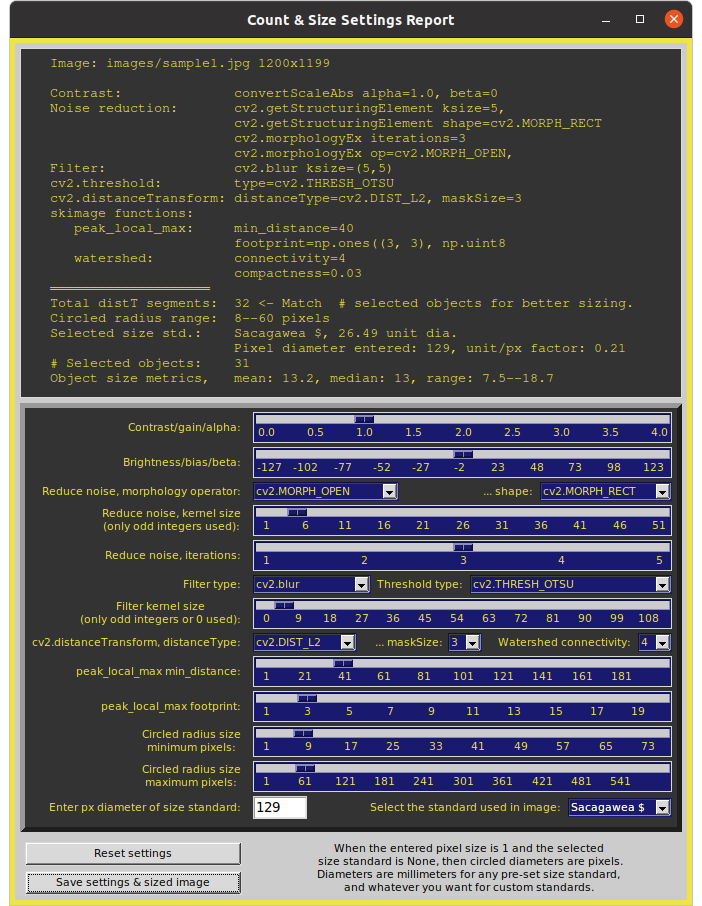
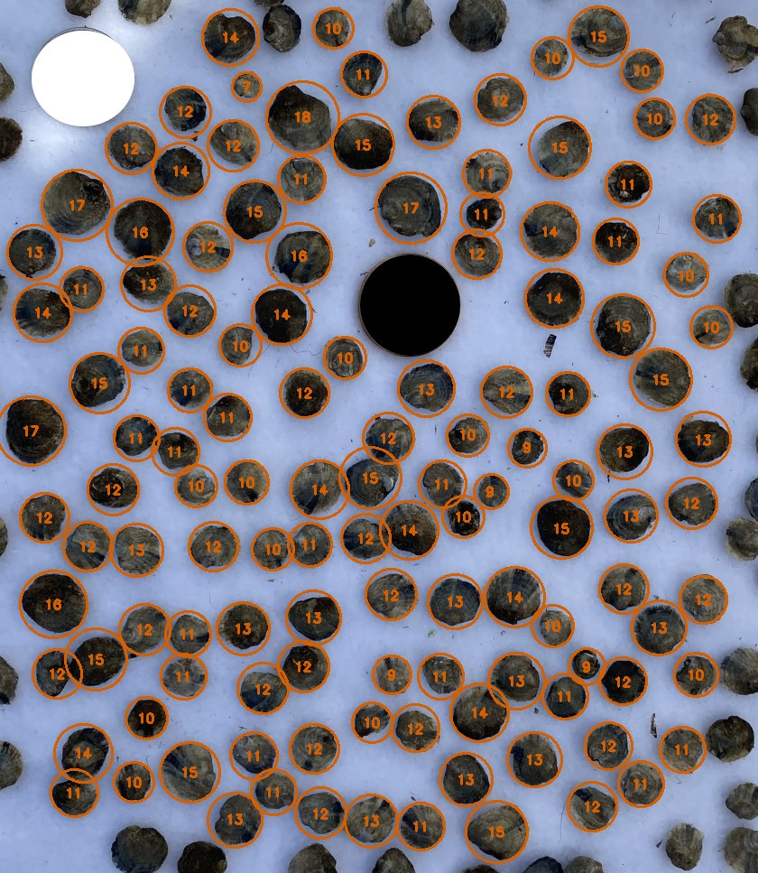

# Project: count-and-size

The interactive Python program, `size_it.py`, can count and size objects from an image file. The main utility is to obtain mean, range, and individual sizes for a sample population. Object segmentation is performed with a compact watershed algorithm on a distance transform. Diameters of minimum enclosing circles determine object lengths. Sizing units are millimeters when a pre-set size standard is used, pixels when not, or determined by the user for a custom standard. Image processing parameters are selected from slider bars and drop down menus (see screenshots, below). Multiple windows display each processing step with live updates as parameters change.

This Project was developed to count and size samples of oyster populations at various stages of aquaculture production, but can be used for measuring any kind of round or oblong objects on a contrasting background. Objects need not all be completely isolated, as touching and slightly overlapping objects can usually be segmented. While segmentation of objects in large or poorly contrasted overlapping clusters is unlikely, such clusters can be screened out by limiting the size range to provide fairly accurate metrics for the remaining individual objects.

Sizing standards are chosen from a pull-down menu. Pre-set standards include a hockey puck and various U.S. coins. If "None" is chosen and the pixel diameter entry is kept as 1 (default settings), then displayed sizes are in pixel units. Pre-set standards report sizes as millimeters. Users have an option for a custom size standard that requires entry of the known size in whatever units are needed.

All modules can be executed on Linux, Windows, and macOS platforms. `size_it.py` is derived from the `contour_it.py` module from the opencv-contour-utils2 GitHub repository.

A text file of object sizes and metrics, settings used, and the resulting annotated image file of sized objects, can be saved. 

Project inspired by code from Adrian Rosebrock:
https://pyimagesearch.com/2016/03/28/measuring-size-of-objects-in-an-image-with-opencv/
https://pyimagesearch.com/2015/11/02/watershed-opencv/

Development environment was Linux Ubuntu 20.04, Windows 11, and macOS 13.2.

### Usage examples:
From within the downloaded repository folder, example command line invocations:

    python3 -m size_it --help
    python3 -m size_it --about
    python3 -m size_it   (uses default input, scale, and color):
    python3 -m size_it --input images/sample1.jpg --scale 1.0
    python3 -m size_it -i images/sample2.jpg -s 0.25 --color yellow --inverse

Note that with no input argument, as in the first example, the default sample1.jpg from the `images` folder is used for input. Additional sample input files are provided in the `images` folder.

On Windows systems, you may need to replace 'python3' with 'python' or 'py'.

Be aware that very large image file may require a few seconds to display the program widows, depending on your system performance. Be patient.

To list command line options: `python3 -m size_it --help`
       
    Image Processing to Size Objects.

    optional arguments:
      -h, --help            Show this help message and exit.
      --about               Provide description, version, GNU license.
      --input PATH/FILE, -i PATH/FILE
                            Path to input image.
      --scale X, -s X       Factor, X, to change displayed image size (default: 0.5).
      --color C, -c C       Annotation color, C. (default: red; options: yellow, orange, green, purple, white, black).
      --inverse             Use this option for dark objects on a light background.

To view basic information, author, version, license, etc.: `python3 -m size_it --about`
 
The Esc or Q key will quit any running module.

The displayed image size can be adjusted with the `--scale` command line argument. All image processing, however, is performed at the original image resolution.

Sample image files, listed below, are provided in the `images` folder.

The default `size_it.py` annotation color for sized objects is red (vermilion). Colors can be changed with the `--color` command line argument if needed for better clarity or to accommodate users with deuteranopia.

Image file examples provided in the `images` folder:
* sample1.jpg (baby oysters on black burlap, 1200x1199 902 kB),
* sample2.jpg (baby oysters on white, Sacagawea coin edited to black, 2627x2629, 1050 kB),
* sample3.jpg (sample2 cropped, with some oysters out of frame, 540x967, 268 kB)

### Requirements:
Python 3.7 or later, plus the packages OpenCV-Python, NumPy, scikit-image, SciPy, and tkinter (Tk/Tcl).

For quick installation of the required Python PIP packages:
from the downloaded GitHub repository folder, run this command

    pip install -r requirements.txt

Alternative commands (system dependent):

    python3 -m pip install -r requirements.txt (Linux and macOS)
    py -m pip install -r requirements.txt (Windows)
    python -m pip install -r requirements.txt (Windows)

As with all repository downloads, it is a good idea to install the requirements in a Python virtual environment to avoid undesired changes in your system's Python library.

### Screenshots:
All screenshots are from an Ubuntu Linux platform. For Windows and macOS platforms, window and widget look or layout may be slightly different.

Above, the report and settings window, using default settings with the following exceptions to report accurate sample count and size metrics: the Sacagawea dollar size standard was selected, its observed pixel diameter of 128 was entered, and it was excluded from the reported object size metrics by reducing the 'Circled radius size maximum' until the coin no longer was annotated with its size (27 mm). The standard's pixel diameter of 128 was obtained from the initial result window when initial default settings were in effect.

Command used, for default image, scale, and color: `python3 -m size_it`, which is equivalent to `python3 -m size_it --input images/sample1.jpg --scale 0.5 --color red`

Below, the resulting annotated image. Clicking the "Save settings & sized image" button exports the annotated image file (at its original resolution), and the report text, which includes a list of the 31 individual mm sizes.

Below, resulting image for an input with objects that extend out of frame, which are excluded from analysis. This exclusion feature provides more accurate size metrics by not analyzing partial objects. The original photo was edited to fill in the shiny gold coin size standard with black for better contrast.

Command used: ` python3 -m size_it -i images/sample3.jpg -s 0.7 -c yellow --inverse`

Below, text output from the saved settings file for the above image, includes parameter settings, size metrics in millimeters, and a list of individual object sizes. 

<pre>
Time saved: 06:17:34AM
Saved image file: sample3_sizes_061734.jpg
Saved settings file: sample3_sizes_settings.txt
Image: images/sample3.jpg 967x840

Contrast:              convertScaleAbs alpha=1.7, beta=-33
Noise reduction:       cv2.getStructuringElement ksize=5,
                       cv2.getStructuringElement shape=cv2.MORPH_RECT
                       cv2.morphologyEx iterations=1
                       cv2.morphologyEx op=cv2.MORPH_CLOSE,
Filter:                cv2.blur ksize=(5,5)
cv2.threshold:         type=cv2.THRESH_OTSU_INVERSE
cv2.distanceTransform: distanceType=cv2.DIST_L2, maskSize=3
skimage functions:
   peak_local_max:     min_distance=29
                       footprint=np.ones((4, 4), np.uint8
   watershed:          connectivity=1
                       compactness=0.03
════════════════════
Total distT segments:  147 <- Match  # selected objects for better sizing.
Circled radius range:  8--56 pixels
Selected size std.:    Sacagawea $, 26.49 unit dia.
                       Pixel diameter entered: 118, unit/px factor: 0.22
# Selected objects:    129
Object size metrics,   mean: 12.1, median: 12, range: 6.9--17.7
</pre>
`6.9, 7.9, 7.9, 8.6, 8.9, 9.1, 9.2, 9.3, 9.5, 9.5, 9.6, 9.7, 9.7, 9.8, 9.8, 9.8, 9.9, 9.9, 10.0, 10.1, 10.2, 10.2, 10.2, 10.4, 10.4, 10.4, 10.5, 10.6, 10.6, 10.7, 10.7, 10.8, 10.8, 10.9, 10.9, 10.9, 11.0, 11.0, 11.0, 11.1, 11.1, 11.2, 11.2, 11.2, 11.2, 11.2, 11.3, 11.3, 11.4, 11.4, 11.4, 11.5, 11.5, 11.5, 11.6, 11.6, 11.7, 11.7, 11.8, 11.8, 11.8, 11.8, 11.8, 11.8, 11.9, 12.0, 12.1, 12.1, 12.1, 12.1, 12.1, 12.2, 12.3, 12.3, 12.3, 12.5, 12.5, 12.5, 12.5, 12.5, 12.6, 12.6, 12.7, 12.7, 12.7, 12.7, 12.8, 12.9, 12.9, 13.0, 13.0, 13.1, 13.1, 13.2, 13.2, 13.3, 13.3, 13.4, 13.7, 13.7, 13.9, 13.9, 14.0, 14.1, 14.1, 14.2, 14.2, 14.2, 14.3, 14.3, 14.4, 14.4, 14.4, 14.6, 14.6, 14.6, 14.7, 14.8, 15.0, 15.0, 15.1, 15.2, 15.5, 15.7, 16.2, 16.5, 16.9, 17.1, 17.7`

### Tips:
1. For best results, use a well-contrasted objects that are not in large overlapping clusters.
2. Backgrounds that are of a fine grain are good to use instead of striving for a uniform featureless background because the de-noise and filtering steps will remove small-grained features. See the use of black burlap in the sample1.jpg figure as an example.
3. Before setting the size standard, adjust parameters to achieve the best separation and counts, then enter the resulting pixel diameter for your selected size standard to convert pixels to units measure. Units are millimeters for the pre-set standards, and whatever you want for custom standards.
4. Once you select "Custom" for a size standard, an entry field pops up for you to fill in the known size.
5. Large files can take a while to process, so don't immediately start mashing buttons if things seem to be stalled.
6. Coin size standards that are shiny can be pre-processed to solid white or black. Or just use a flat black or flat white object as a standard.
7. Fill in the pixel diameter and type of size standard once segmentation and counts are optimized. In addition to making the size ranges (as radii) easier to navigate, it will also provide the most accurate size metrics.
8. Size metrics are most accurate when the size standard is excluded from analysis. The easiest way to do that is to use a standard that is the largest or smallest object in the sample, then adjust the "Contour area size" sliders until just the standard's diameter is excluded.

### Known Issues:
Waiting for user feedback.

### Attributions
All image files are from the author, C.S. Echt.

### Pre-set size standards and diameters.

| Standard object | mm dia. | Notes                       |
|-----------------|--------:|-----------------------------|
| None            |     1.0 | Default, diameter is pixels |
| Custom          |       0 | User enters a known size    |
| Puck            |    76.2 | Standard 3 inch hockey puck |
| Cent            |    19.0 |                             |
| Nickel          |    21.2 |                             |
| Dime            |    17.9 |                             |
| Quarter         |    24.3 |                             |
| Half Dollar     |    30.6 | a.k.a Kennedy half dollar   |
| Sacagawea $     |    26.5 | Minted from 2000 to 2008    |
| Eisenhower $    |    38.1 | Minted from 1971 to 1978    |
