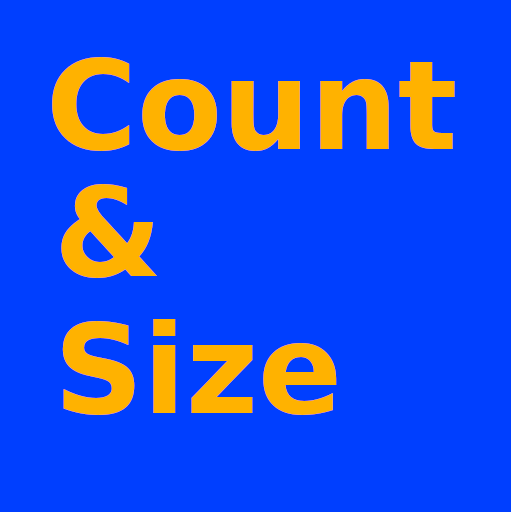

# Project: count-and-size

Image of the program's desktop icon

The interactive Python program, `size_it.py`, is a tkinter GUI for OpenCV processing of an image to obtain sizes, means,
and ranges of objects in a sample population. The distance transform and
watershed algorithms are used interactively by setting their parameter
values with slide bars and pull-down menus. Related image processing
factors like contrast, brightness, noise reduction, and filtering are 
also adjusted interactively, with live updating of the resulting images.

A report is provided of parameter settings, object count, individual
object sizes, and sample size mean and range, along with an annotated
image file of labeled objects.

This Project was developed to sample oyster populations at various stages of aquaculture production, but can be used to measure any group of round or oblong objects on a contrasting background. Objects need not all be completely isolated, as touching and slightly overlapping objects can usually be segmented. While segmentation of objects in large or poorly contrasted overlapping clusters is unlikely, such clusters can be screened out by limiting the size range to provide fairly accurate metrics for the remaining individual objects.

Sizing standards are chosen from a pull-down menu. Pre-set standards include a 3-inch hockey puck and various U.S. coins. Sizing units are millimeters when one of the pre-set size standards is used, pixels when not, or determined by the user when using a custom standard. If "None" is chosen as a standard and the pixel diameter entry is kept as 1 (default settings), then displayed sizes are in pixel units. Users have an option for a custom size standard that requires entry of the known size in whatever units are needed.

All modules can be executed on Linux, Windows, and macOS platforms. `size_it.py` is derived from the `contour_it.py` module of the opencv-contour-utils2 GitHub repository.

A text file of object sizes and metrics, parameter settings, and the resulting annotated image file of sized objects, can be saved. 

Project inspired by code from Adrian Rosebrock:
https://pyimagesearch.com/2016/03/28/measuring-size-of-objects-in-an-image-with-opencv/
https://pyimagesearch.com/2015/11/02/watershed-opencv/

The to_precision.py module is from:
https://github.com/BebeSparkelSparkel/to-precision/releases/tag/0.0.0

Development environment was Linux Ubuntu 20.04, Windows 11, and macOS 13.2, with Python 3.8.

### Usage examples:
From within the downloaded repository folder, recommended command line invocation of the size_it.py module: `python3 -m size_it`

To view basic information, author, version, license, etc.: `python3 -m size_it --about`

To have the settings and size report print to the Terminal in addition to saving to file: `python3 -m size_it --terminal` (or can use -t).

As with any Python downloads, running within a virtual environment is recommended.

On Windows systems, you may need to replace 'python3' with 'python' or 'py'.

Be aware that very large image file may require a few seconds to display the image widows, depending on your system performance. Be patient.

The Esc or Crtl-Q key will quit the program once a file is selected. To quit the initial Open file dialog, just close the window in the usual manner.

Sample image files, listed below, are provided in the `images` folder. This is the default location for selecting an input image file, but you can browse to where ever your favorite file is.

Image file examples provided in the `images` folder, where sample1 was used to establish the default parameters:
* sample1.jpg (baby oysters on black burlap, 1200x1199 902 kB),
* sample2.jpg (baby oysters on white, Sacagawea coin edited to black, 2627x2629, 1050 kB),
* sample3.jpg (sample2 cropped, with some oysters out of frame, 540x967, 268 kB)

### Requirements:
Python 3.7 or later, plus the packages OpenCV-Python, NumPy, scikit-image, SciPy, and tkinter (Tk/Tcl).

For quick installation of the required Python PIP packages:
from the downloaded GitHub repository folder, run this command

    pip install -r requirements.txt

Alternative commands (system dependent):

    python3 -m pip install -r requirements.txt (Linux and macOS)
    py -m pip install -r requirements.txt (Windows)
    python -m pip install -r requirements.txt (Windows)

As with all repository downloads, it is a good idea to install the requirements in a Python virtual environment to avoid undesired changes in your system's Python library.

### Screenshots:
All screenshots are from an Ubuntu Linux platform. For Windows and macOS platforms, window and widget look or layout may be different.

Below, initial file selection window. (The *_screenshot.jpg files are used for this README.)
Currently supported image file types are JPG, PNG, and TIFF.

Once a file is selected, basic run parameters are set in a new pop-up window. The scale slider determines the screen size of the processed image windows. Available annotation colors are: blue, orange, sky blue, blueish green, vermilion, reddish purple, yellow, black, white, red, and green. All but red and green should be suitable for users with deuteranopia. The inverse selections are for the kind of object vs. background contrast the image has: "No" for light are dark, "Yes" for dark on light. This determines the initial cv2.threshold type, but can be changed later, if needed, in the main settings.

When the "Process now" is clicked, the main settings and report window appears (below), along with multiple processed image windows. In this analysis, the Sacagawea dollar size standard was selected and its observed pixel diameter of 128 was entered. It was subsequently excluded from the reported object size metrics by reducing the 'Circled radius size maximum' until the coin no longer was annotated with its size (27 mm). The standard's pixel diameter of 128 was obtained from the initial result window when initial default settings were in effect. Here it is reported that 31 object were found, with a mean of 13.2 mm, a median of 13 mm, covering a range of 7.5 to 18.7 mm.

Below, the resulting annotated image (with vermilion color). Clicking the "Save settings & sized image" button exports the annotated image file (at its original resolution), and the report text, which includes a list of the 31 individual estimated sizes.

Below, resulting image for the input `sample3.jpg` and the text output from the saved settings. Note that objects that extend out of frame are excluded from analysis. This exclusion feature provides more accurate size metrics by not analyzing partial objects. The original photo was previously edited to fill in the shiny gold coin size standard with black for better contrast. The white circle is another coin that was edited to exclude it from analysis. The following report text includes parameter settings used, size metrics in millimeters, and a list of individual object sizes.

<pre>
Time saved: 06:17:34AM
Saved image file: sample3_sizes_061734.jpg
Saved settings file: sample3_sizes_settings.txt
Image: images/sample3.jpg 967x840

Contrast:              convertScaleAbs alpha=1.7, beta=-33
Noise reduction:       cv2.getStructuringElement ksize=5,
                       cv2.getStructuringElement shape=cv2.MORPH_RECT
                       cv2.morphologyEx iterations=1
                       cv2.morphologyEx op=cv2.MORPH_CLOSE,
Filter:                cv2.blur ksize=(5,5)
cv2.threshold:         type=cv2.THRESH_OTSU_INVERSE
cv2.distanceTransform: distanceType=cv2.DIST_L2, maskSize=3
skimage functions:
   peak_local_max:     min_distance=29
                       footprint=np.ones((4, 4), np.uint8
   watershed:          connectivity=1
                       compactness=0.03
════════════════════
Total distT segments:  147 <- Match  # selected objects for better sizing.
Circled radius range:  8--56 pixels
Selected size std.:    Sacagawea $, 26.49 unit dia.
                       Pixel diameter entered: 118, unit/px factor: 0.22
# Selected objects:    129
Object size metrics,   mean: 12.1, median: 12, range: 6.9--17.7
</pre>
`6.9, 7.9, 7.9, 8.6, 8.9, 9.1, 9.2, 9.3, 9.5, 9.5, 9.6, 9.7, 9.7, 9.8, 9.8, 9.8, 9.9, 9.9, 10.0, 10.1, 10.2, 10.2, 10.2, 10.4, 10.4, 10.4, 10.5, 10.6, 10.6, 10.7, 10.7, 10.8, 10.8, 10.9, 10.9, 10.9, 11.0, 11.0, 11.0, 11.1, 11.1, 11.2, 11.2, 11.2, 11.2, 11.2, 11.3, 11.3, 11.4, 11.4, 11.4, 11.5, 11.5, 11.5, 11.6, 11.6, 11.7, 11.7, 11.8, 11.8, 11.8, 11.8, 11.8, 11.8, 11.9, 12.0, 12.1, 12.1, 12.1, 12.1, 12.1, 12.2, 12.3, 12.3, 12.3, 12.5, 12.5, 12.5, 12.5, 12.5, 12.6, 12.6, 12.7, 12.7, 12.7, 12.7, 12.8, 12.9, 12.9, 13.0, 13.0, 13.1, 13.1, 13.2, 13.2, 13.3, 13.3, 13.4, 13.7, 13.7, 13.9, 13.9, 14.0, 14.1, 14.1, 14.2, 14.2, 14.2, 14.3, 14.3, 14.4, 14.4, 14.4, 14.6, 14.6, 14.6, 14.7, 14.8, 15.0, 15.0, 15.1, 15.2, 15.5, 15.7, 16.2, 16.5, 16.9, 17.1, 17.7`

### Tips:
1. For best results, use a well-contrasted objects that are not in large overlapping clusters. If possible, use a lightbox and minimal top lighting for objects' photo.
2. Backgrounds that are of a fine grain are good to use instead of striving for a uniform featureless background because the de-noise and filtering steps will remove small-grained features. See the use of black burlap in the sample1.jpg figure as an example.
3. Before setting the size standard, adjust parameters to achieve the best separation and counts, then enter the resulting pixel diameter for your selected size standard to convert pixels to units measure. Units are millimeters for the pre-set standards, and whatever you want for custom standards.
4. Once you select "Custom" for a size standard, an entry field pops up for you to fill in the known size.
5. Large files can take a while to process, so don't immediately start mashing buttons if things seem to be stalled.
6. Coin size standards that are shiny can be pre-processed to solid white or black. Or just use a flat black or flat white object as a standard.
7. Fill in the pixel diameter and type of size standard once segmentation and counts are optimized. In addition to making the size ranges (as radii) easier to navigate, it will also provide the most accurate size metrics.
8. Size metrics are most accurate when the size standard is excluded from analysis. The easiest way to do that is to use a standard that is the largest or smallest object in the sample, then adjust the "Contour area size" sliders until just the standard's diameter is excluded.
9. Note that when a custom size standard is used, the displayed object sizes and their summary metrics are presented with the same number of significant figures as the entered size value. See: https://en.wikipedia.org/wiki/Significant_figures#Significant_figures_rules_explained. Depending on the magnitude of the entered size, displayed values may be in power notation. Saved individual size lists, however, are converted to decimal numbers. When a preset standard is used, sizes are displayed as integers, but saved individual sizes will have one decimal precision.

### Known Issues:
Waiting for user feedback.

### Attributions
All image files are from the author, C.S. Echt.

### Pre-set size standards and diameters.

| Standard object | mm dia. | Notes                       |
|-----------------|--------:|-----------------------------|
| None            |     1.0 | Default, diameter is pixels |
| Custom          |       0 | User enters a known size    |
| Puck            |    76.2 | Standard 3 inch hockey puck |
| Cent            |    19.0 |                             |
| Nickel          |    21.2 |                             |
| Dime            |    17.9 |                             |
| Quarter         |    24.3 |                             |
| Half Dollar     |    30.6 | a.k.a Kennedy half dollar   |
| Sacagawea $     |    26.5 | Minted from 2000 to 2008    |
| Eisenhower $    |    38.1 | Minted from 1971 to 1978    |
