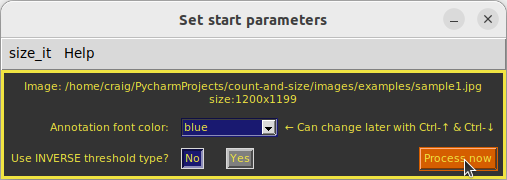
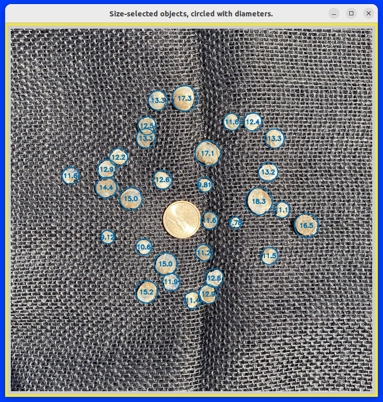

# Project: count-and-size

Farmed oyster population sample (top); the analyzed back lit image, with annotations (bottom), using a U.S. quarter dollar for the size standard. Sample mean was 93.1 mm, n=27.

The interactive Python program, `size_it.py`, is a tkinter GUI for OpenCV processing of an image to obtain sizes, means,
and ranges of objects in a sample population. The distance transform and
watershed algorithms are used interactively by setting their parameter
values with slide bars and pull-down menus. Related image processing
factors like contrast, brightness, noise reduction, and filtering are 
also adjusted interactively, with live updating of the resulting images.

A report is provided of parameter settings, object count, individual
object sizes, and sample size mean and range, along with an annotated
image file of labeled objects.

The program `size_it_RW.py` accomplishes object segmentation with the random walker algorithm in place of watershed. While random walker may provide better object segmentation for some images, it can increase processing times by about 8-fold. Large images with many objects may take minutes to process. The main difference in using `size_it_RW.py` is that interactive processing of counts and sizes is triggered from a Button command instead of the action of individual sliders and pull-downs. This allows the distance transform and peak-local-max parameters to be changed and executed as a group. This approach can save time when you already have some idea about the combination of these settings you need. Pre-processing functions, such as noise reduction, filtering, and thresholding, still provide live updates when their individual slider or pull-down values are changed.

This Project was developed to sample oyster populations at various stages of aquaculture production, but can be used to measure any group of round or oblong objects on a contrasting background. Objects need not all be completely isolated, as touching and slightly overlapping objects can usually be segmented. While segmentation of objects in large or poorly contrasted overlapping clusters is unlikely, such clusters may be screened out by limiting the size range to provide fairly accurate metrics for the remaining individually segmented objects.

Sizing standards are chosen from a pull-down menu. Pre-set standards include a 3-inch hockey puck and various U.S. coins. Sizing units are millimeters when one of the pre-set size standards is used, pixels when not, or determined by the user when using a custom standard. If "None" is chosen as a standard and the pixel diameter entry is kept as 1 (default settings), then displayed sizes are in pixel units. Users have an option for a custom size standard that requires entry of the known size in whatever units are needed.

All modules can be executed on Linux, Windows, and macOS platforms. `size_it.py` is derived from the `contour_it.py` module of the opencv-contour-utils2 GitHub repository.

A text file of object sizes and metrics, parameter settings, and the resulting annotated image file of sized objects, can be saved. 

Project inspired by code from Adrian Rosebrock:
https://pyimagesearch.com/2016/03/28/measuring-size-of-objects-in-an-image-with-opencv/
https://pyimagesearch.com/2015/11/02/watershed-opencv/

The to_precision.py module is from:
https://github.com/BebeSparkelSparkel/to-precision/releases/tag/0.0.0

Development environment was Linux Ubuntu 20.04 (Python 3.8), Windows 11 (Python 3.11), and macOS 13.2 (Python 3.9).

### Usage examples:
From within the downloaded repository folder, recommended command line invocation is : `python3 -m size_it` or `python3 -m size_it_RW`.

To view basic information, author, version, license, etc.: `python3 -m size_it --about`

To have the settings and size report print to the Terminal in addition to saving to file: `python3 -m size_it --terminal` (or can use -t).

As with any Python downloads, running within a virtual environment is recommended.

On Windows systems, you may need to replace 'python3' with 'python' or 'py'.

Be aware that very large image file may require a few seconds to display the image widows, depending on your system performance. Be patient.

The Esc or Crtl-Q key will quit the program once a file is selected. To quit the initial Open file dialog, just close the window in the usual manner.

Sample image files, listed below, are provided in this distribution's `images` directory. From the opening window, users can browse to there or whichever directory contains their image for analysis. Settings and annotated images are saved to the selected image's directory.

Image file examples provided in the `images/examples` folder of this distribution, where sample1 was used to establish default processing parameters:
* sample1.jpg (baby oysters on black burlap, 1200x1199 902 kB),
* sample2.jpg (baby oysters on white, Sacagawea coin edited to black, 2627x2629, 1050 kB),
* sample3.jpg (sample2 cropped, with some oysters out of frame, 540x967, 268 kB)

### Requirements:
Python 3.7 or later, plus the packages OpenCV-Python, NumPy, scikit-image, SciPy, and tkinter (Tk/Tcl).

For quick installation of the required Python PIP packages:
from the downloaded GitHub repository folder, run this command

    pip install -r requirements.txt

Alternative commands (system dependent):

    python3 -m pip install -r requirements.txt (Linux and macOS)
    py -m pip install -r requirements.txt (Windows)
    python -m pip install -r requirements.txt (Windows)

Note that the PyAMG package listed in requirements.txt is used only with `size_it_RW.py` and is not required for `size_it.py`. See https://pypi.org/project/pyamg/ for information.

As with all repository downloads, it is a good idea to install the requirements in a Python virtual environment to avoid undesired changes in your system's Python library.

### Screenshots:
Most screenshots are from an Ubuntu Linux platform. For Windows and macOS platforms, window and widget look or layout may be different.

Below, initial file selection window. (The *_screenshot.jpg files are used for this README.)
Currently supported image file types are JPG, PNG, and TIFF.

Once a file is selected, basic run parameters are set in a new pop-up window. The scale slider determines the screen size of the processed image windows. Available annotation colors are: blue, orange, sky blue, blueish green, vermilion, reddish purple, yellow, black, white, red, and green. All but red and green should be suitable for users with deuteranopia. The inverse selections are for the kind of object vs. background contrast the image has: "No" for light are dark, "Yes" for dark on light. This determines the initial cv2.threshold type, but can be changed later, if needed, in the main settings.

When the "Process now" is clicked, the main settings and report window appears (below, from Windows system), along with multiple processed image windows. In this analysis, the Sacagawea dollar size standard was selected and its observed pixel diameter of 128 was entered. It was subsequently excluded from the reported object size metrics by reducing the 'Circled radius size maximum' until the coin no longer was annotated with its size (26.5 mm). The standard's pixel diameter of 129 was obtained from the initial result window when initial default settings were used. The report show that 31 object were found, with a mean of 12.9 mm, a median of 12.7 mm, covering a range of 7.70 to 18.4 mm.

Below, the resulting annotated image. Clicking the "Save settings & sized image" button exports the annotated image (at its original resolution), and the settings report, including the 31 individual sizes, to the input image's folder.

Below, resulting annotated image for the input `sample3.jpg` and the text output from the saved settings. Note that objects that extend out of frame are excluded from analysis. This exclusion feature provides more accurate size metrics by not analyzing partial objects. The original photo was previously edited to fill in the shiny gold coin size standard with black for better contrast. The white circle is another coin that was edited to exclude it from analysis. The following report text includes parameter settings used, size metrics in millimeters, and a list of individual object sizes. Analyzed with `size_it_RW.py`, which uses the Random Walker algorithm.

<pre>
Time saved: 12:53:49PM
Saved image file: sample3_size_it_RW_125349.jpg
Image: /home/craig/count-and-size-main/images/sample3.jpg
Image size: 967x840
Contrast:              convertScaleAbs alpha=1.8, beta=0
Noise reduction:       cv2.getStructuringElement ksize=5,
                       cv2.getStructuringElement shape=cv2.MORPH_ELLIPSE
                       cv2.morphologyEx iterations=1
                       cv2.morphologyEx op=cv2.MORPH_OPEN,
Filter:                cv2.blur ksize=(5, 5)
cv2.threshold:         type=cv2.THRESH_OTSU_INVERSE
cv2.distanceTransform: distanceType=cv2.DIST_L2, maskSize=5
skimage functions:
   peak_local_max:     min_distance=34
                       footprint=np.ones((3, 3), np.uint8)
════════════════════
# distTrans segments:  159
Selected size range:   8--48 pixels, diameter
Selected size std.:    Sacagawea $, 26.5 mm diameter
                       Pixel diameter entered: 117, unit/px factor: 0.226
# Selected objects:    129
Object size metrics,   mean: 12.3, median: 12.2, range: 6.92--18.1
</pre>
`6.92, 7.77, 8.04, 8.76, 9.17, 9.2, 9.64, 9.66, 9.68, 9.7, 9.8, 9.83, 9.88, 9.91, 9.93, 9.98, 10.0, 10.1, 10.2, 10.2, 10.3, 10.4, 10.4, 10.6, 10.6, 10.6, 10.7, 10.7, 10.8, 10.8, 10.8, 10.8, 10.9, 10.9, 11.0, 11.1, 11.1, 11.2, 11.2, 11.2, 11.2, 11.3, 11.3, 11.3, 11.4, 11.4, 11.4, 11.4, 11.5, 11.5, 11.5, 11.7, 11.7, 11.7, 11.8, 11.8, 11.9, 12.0, 12.0, 12.0, 12.1, 12.1, 12.1, 12.1, 12.2, 12.2, 12.3, 12.3, 12.4, 12.4, 12.4, 12.4, 12.5, 12.6, 12.6, 12.7, 12.7, 12.7, 12.8, 12.8, 12.8, 12.8, 12.8, 12.9, 13.0, 13.0, 13.1, 13.1, 13.2, 13.2, 13.3, 13.3, 13.3, 13.4, 13.5, 13.6, 13.7, 13.7, 13.9, 13.9, 14.0, 14.0, 14.3, 14.3, 14.4, 14.4, 14.4, 14.4, 14.5, 14.5, 14.6, 14.7, 14.7, 14.7, 14.8, 14.8, 14.9, 15.1, 15.1, 15.4, 15.4, 15.5, 15.9, 15.9, 16.4, 16.9, 17.1, 17.4, 18.1`

### Tips:
1. For best results, use a well-contrasted objects that are not in large overlapping clusters. Best results are obtained using a lightbox with minimal top lighting to photograph objects.
2. Before setting the size standard, adjust parameters to achieve the best separation and counts, then enter the resulting pixel diameter for your selected size standard to convert pixels to units measure. Units are millimeters for the pre-set standards, and whatever you want for custom standards.
3. Once you select "Custom" for a size standard, an entry field pops up to fill in the known size. 
4. Large files can take a while to process, so don't immediately start mashing buttons if things seem to be stalled.
5. Size standards that are shiny can be pre-processed to solid white or black. Or just use a flat black or flat white object as a standard.
6. Fill in the pixel diameter and type of size standard once segmentation and counts are optimized. In addition to making the size ranges (as radii) easier to navigate, it will also provide the most accurate size metrics.
7. Size metrics are most accurate when the size standard is excluded from analysis. The easiest way to do that is to use a standard that is the largest or smallest object in the sample, then adjust the "Contour area size" sliders until just the standard's diameter is excluded.
8. The number of significant figures reported are determined by standard's unit size or its pixel diameter, whichever has fewer sig. fig. This limit also holds when a custom size standard is used. See: https://en.wikipedia.org/wiki/Significant_figures#Significant_figures_rules_explained. Depending on the magnitude of the entered custom size, displayed size values may be in power notation. Saved individual size lists, however, are converted to decimal numbers.
9. Right-click on an image in one of the windows to save it to file. The image, saved to original image's folder, will be at the specified scale for screen display, not the image file's original resolution. To save the annotated result image (sized & circled) at its original resolution, use the 'Save settings...' button.
10. Annotation font size for selected objects can be changed with Ctrl + and Ctrl - keys. Annotation line thickness can be changed with Shift-Ctrl + and Shift-Ctrl -.

### Known Issues:
On occasion, the program may stall at the step where the info displays, "Contours drawn. Calculating sizes...". Quit the program from the Terminal (it will not respond to it regular Quit commands) and try again. It was not any specific settings, so you can use those prior settings again. The problem is with lengthy "Process ForkPoolWorker" iterations in the multiprocessing Pool module that occur with an unknown condition. The issue seem most likely to happen with `size_it_RW.py`.

### Attributions
All image files are from the author, C.S. Echt.

### Pre-set size standards and diameters.

| Standard object | mm dia. | Notes                       |
|-----------------|--------:|-----------------------------|
| None            |     1.0 | Default, diameter is pixels |
| Custom          |       0 | User enters a known size    |
| Puck            |    76.2 | Standard 3 inch hockey puck |
| Cent            |    19.0 |                             |
| Nickel          |    21.2 |                             |
| Dime            |    17.9 |                             |
| Quarter         |    24.3 |                             |
| Half Dollar     |    30.6 | a.k.a Kennedy half dollar   |
| Sacagawea $     |    26.5 | Minted from 2000 to 2008    |
| Eisenhower $    |    38.1 | Minted from 1971 to 1978    |
