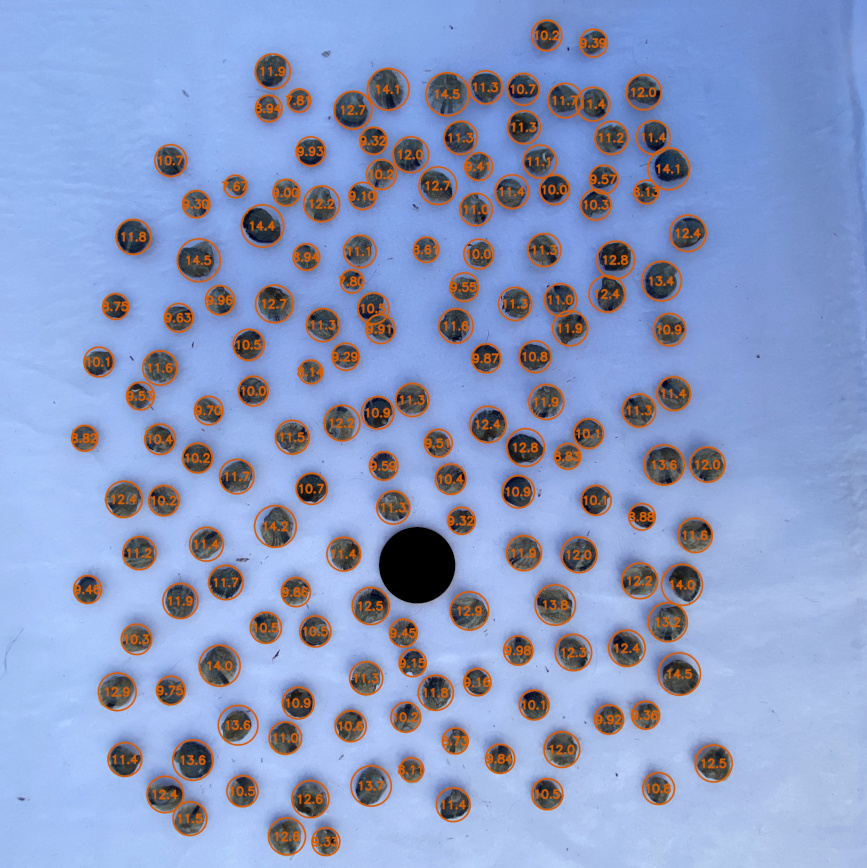
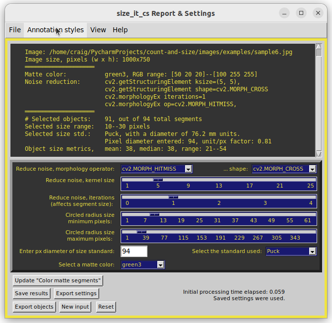
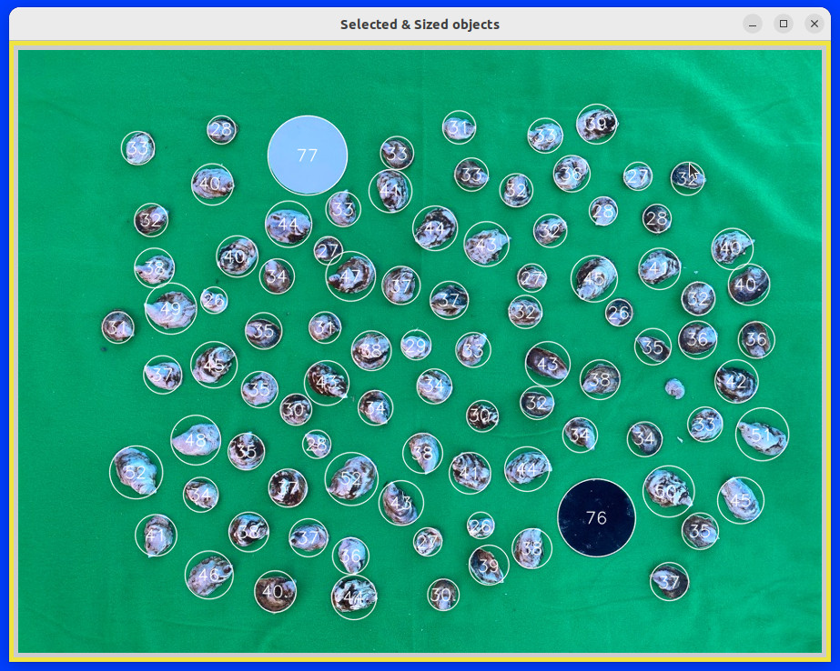

# Project: count-and-size

Farmed oyster population sample (top); the analyzed back lit image, with annotations (bottom), using a U.S. quarter dollar for the size standard. Sample mean was 93.1 mm, n=27.

## Table of Contents
* [Overview](#Overview)
* [Usage examples](#Usage-examples)
* [Requirements](#Requirements)
* [Screenshots](#Screenshots)
* [Sizing with lens distortion](#Sizing-with-lens-distortion)
* [Tips](#Tips)
* [Known Issues](#Known-Issues)
* [Attributions](#Attributions)
* [Tables of constants](#Tables)

### Overview:

The interactive Python programs, `size_it.py` and  `size_it_cs.py`, are tkinter GUIs for OpenCV processing of an image to obtain sizes, means,
and ranges of objects in a sample population. This Project was developed to sample oyster populations at various stages of aquaculture production, but can be used to measure any sample population of round or oblong objects photographed on a contrasting or color matte background.

`size_it.py` uses distance transform and either watershed or random walker algorithms interactively by setting their respective parameter
values with slide bars and pull-down menus. Related image preprocessing
factors like contrast, brightness, noise reduction, and filtering are 
also adjusted interactively, with live updating of the resulting images. These algorithmic approaches do a fairly good job of segmenting touching and slightly overlapping objects given the proper parameter settings.

Using random walker may provide better object segmentation than watershed for some images, but it can greatly increase processing times; large images with many objects may take several minutes to process. With either segmentation algorithm, interactive processing of counts and sizes is triggered from a Button command instead of the action of individual sliders and pull-downs, as with the preprocessing steps. This approach can save time when you already have some idea about the combination of parameter settings needed.

An alternative approach is provided by `size_it_cs.py` that uses a color screen (cs) matte to subtract background color, such as a green screen, from objects that don't have colors found in the background's color range. Different color screen ranges are provided for green, blue, black and white. This approach is generally much faster than using watershed or random walker algorithms, but, by itself, does not segment touching or overlapping objects. For a workaround, see [Tips](#Tips), below.

Object sizes are calculated from some object of known size included in image. Sizing standards are set from a pull-down menu. Pre-set standards include a 3-inch hockey puck and various U.S. coins. Sizing units are millimeters when one of the pre-set size standards is used, pixels when not, or determined by the user when using a custom standard. If "None" is chosen as a standard and the pixel diameter entry is kept as 1 (default settings), then displayed sizes are in pixel units. Users have an option for a custom size standard. When used, the user enters the standard's known size in whatever units are needed.

Results can be saved to a text report of parameter settings, object count, individual
object sizes, and sample size mean and range, along with an annotated
image file of labeled objects. Segmented objects can also be saved as individual image files.

All modules can be executed on Linux, Windows, and macOS platforms. `size_it.py` is derived from the `contour_it.py` module of the opencv-contour-utils2 GitHub repository. `size_it_cs.py` is derived from `size_it.py`.

Project inspired by code from Adrian Rosebrock:
https://pyimagesearch.com/2016/03/28/measuring-size-of-objects-in-an-image-with-opencv/
https://pyimagesearch.com/2015/11/02/watershed-opencv/

The to_precision.py module is from:
https://github.com/BebeSparkelSparkel/to-precision/releases/tag/0.0.0

Development environment was Linux Ubuntu 20.04 (Python 3.8), Windows 11 (Python 3.11), and macOS 13.2 (Python 3.9).

### Usage examples:
From within the downloaded repository folder, recommended command line invocation is : `python3 -m size_it`

To view basic information, author, version, license, etc.: `python3 -m size_it --about`

To have the settings and size report print to the Terminal in addition to saving to file: `python3 -m size_it --terminal` (or can use -t).

As with any Python downloads, running within a virtual environment is recommended.

On Windows systems, you may need to replace 'python3' with 'python' or 'py'.

Be aware that very large image file may require a few seconds to display the image widows, depending on your system performance. Be patient.

The Esc or Crtl-Q key will quit the program once a file is selected. To quit the initial Open file dialog, just close the window in the usual manner.

Sample image files, listed below, are provided in this distribution's `images` directory. From the opening window, users can browse to there or whichever directory contains their image for analysis. Settings and annotated images are saved to the selected image's directory.

Image file examples provided in the `images/examples` folder of this distribution, where sample1 was used to establish default processing parameters:
* sample1.jpg (baby oysters on black burlap, 1200x1199 902 kB),
* sample2.jpg (baby oysters on white, Sacagawea coin edited to black, 2627x2629, 1050 kB),
* sample3.jpg (sample2 cropped, with some oysters out of frame, 540x967, 268 kB)
* sample4.jpg (mature oysters on white, top-lit, used in README figure, 984x705, 363 kB)
* sample5.jpg (sample4 oysters, backlit, 898x630, 77 kB)
* sample6.jpg (green screen oysters, 1000x750, 258 kB)

Upon selecting a file at startup you are prompted to apply saved settings, if a previously exported `saved_settings.json` text file exists in the input image's directory, or to use default settings. Settings can be saved for future use with the "Export settings" button. (An existing settings file in the input directory will be overwritten.) Displayed image screen sizes are scaled to proportionally fit your screen. Scaling can be changed later with the Ctrl-Left_arrow and Ctrl-Right_arrow keys (use Shift-Control on macOS).

### Requirements:
Python 3.7 or later, plus the packages OpenCV-Python, NumPy, scikit-image, SciPy, pyAMG, and tkinter (Tk/Tcl). See Known Issues, below regarding pyAMG.

For quick installation of the required Python PIP packages:
from the downloaded GitHub repository folder, run this command

    pip install -r requirements.txt

Alternative commands (system dependent):

    python3 -m pip install -r requirements.txt (Linux and macOS)
    py -m pip install -r requirements.txt (Windows)
    python -m pip install -r requirements.txt (Windows)

As with all repository downloads, it is good practice to install the required packages in a Python virtual environment to avoid undesired changes in your system's Python library.

### Screenshots:
Most screenshots are from an Ubuntu Linux platform. For Windows and macOS platforms, window and widget look or layout may be different.

Below, initial file selection window. (The *_screenshot.jpg files in the `images` folder are used for this README.)
Currently supported image file types are JPG, PNG, and TIFF.

Once a file is selected, basic run parameters are set in a new pop-up window. Available annotation colors are: blue, orange, sky blue, blueish green, vermilion, reddish purple, yellow, black, white, red, and green. All but red and green should be suitable for users with deuteranopia. The "INVERSE" selections are for the kind of object vs. background contrast the image has: "No" for light-on-dark, "Yes" for dark-on-light. This determines the initial cv2.threshold type, but can be changed later, if needed, in the main settings.

When the "Process now" is clicked, the main settings and report window appears (below), along with multiple processed image windows. In this analysis, the Sacagawea dollar size standard was selected and its observed pixel diameter of 129 was entered. It was subsequently excluded from the reported object size metrics by reducing the 'Circled radius size maximum' until the coin no longer was annotated with its size (26.5 mm). The standard's pixel diameter of 129 was obtained from the initial result window when initial default settings were used. The report shows that 31 objects were selected from 32 Random Walker segments, giving a mean of 12.9 mm, a median of 12.6 mm, and a range of 7.78 to 18.3 mm.

Below, the resulting annotated image. Clicking the "Save settings & sized image" button exports the annotated image (at its original resolution), and the settings report, including the 31 individual sizes, to the input image's folder.

Below, resulting annotated image for the input `sample2.jpg` and the text output of its saved settings. Objects were properly segmented by adjusting (from their defaults) the values for contrast, noise reduction, filter, and peak local maximum. Values for the selected size range and standard were then applied.

<pre>
Time saved: 2023/12/06 10:56:28AM
Saved image file: sample2_size_it_20231206105628.jpg
Image: /home/craig/PycharmProjects/count-and-size/images/examples/sample2.jpg
Image size: 2629x2627
Segmentation algorithm: Watershed
════════════════════
Contrast:              convertScaleAbs alpha=1.5, beta=0
Noise reduction:       cv2.getStructuringElement ksize=9,
                       cv2.getStructuringElement shape=cv2.MORPH_ELLIPSE
                       cv2.morphologyEx iterations=1
                       cv2.morphologyEx op=cv2.MORPH_OPEN,
Filter:                cv2.bilateralFilter ksize=(5, 5)
cv2.threshold:         type=cv2.THRESH_OTSU_INVERSE
cv2.distanceTransform: distanceType=cv2.DIST_L2, maskSize=3
skimage functions:
   peak_local_max:     min_distance=64, footprint=np.ones((3, 3))
   watershed:          connectivity=4, compactness=1.0
════════════════════
# Selected objects:    158, out of 181 total segments
Selected size range:   8--84 pixels, diameter
Selected size std.:    Sacagawea $, 26.5 mm diameter
                       Pixel diameter entered: 236, unit/px factor: 0.112
Object size metrics,   mean: 11.0, median: 11.0, range: 7.67--14.5
</pre>
Below, annotated result for the input `sample3.jpg` and text output of its saved settings. Note that objects that extended out of frame were excluded from analysis. This exclusion feature provides more accurate size metrics by not analyzing partial objects. The original photo was previously edited to fill in the shiny gold coin size standard with black for better contrast. The white circle is another coin that was edited to exclude it from analysis. The following report text includes parameter settings used, size metrics in millimeters, and a list of individual object sizes. Run with Random Walker segmentation algorithm option.

<pre>
Time saved: 2023/12/06 12:16:25PM
Saved image file: sample3_size_it_rw_20231206121625.jpg
Image: /home/craig/PycharmProjects/count-and-size/images/examples/sample3.jpg
Image size: 967x840
Segmentation algorithm: Random Walker
════════════════════
Contrast:              convertScaleAbs alpha=1.8, beta=0
Noise reduction:       cv2.getStructuringElement ksize=7,
                       cv2.getStructuringElement shape=cv2.MORPH_ELLIPSE
                       cv2.morphologyEx iterations=1
                       cv2.morphologyEx op=cv2.MORPH_OPEN,
Filter:                cv2.blur ksize=(7, 7)
cv2.threshold:         type=cv2.THRESH_OTSU_INVERSE
cv2.distanceTransform: distanceType=cv2.DIST_L2, maskSize=5
skimage functions:
   peak_local_max:     min_distance=30, footprint=np.ones((12, 12))
   watershed:          connectivity=n/a, compactness=n/a
════════════════════
# Selected objects:    129, out of 229 total segments
Selected size range:   7--38 pixels, diameter
Selected size std.:    Sacagawea $, 26.5 mm diameter
                       Pixel diameter entered: 117, unit/px factor: 0.226
Object size metrics,   mean: 12.3, median: 12.2, range: 6.74--18.1
</pre>
`6.74, 7.98, 8.25, 8.71, 9.02, 9.04, 9.56, 9.59, 9.6, 9.8, 9.8, 9.88, 9.9, 9.95, 10.0, 10.0, 10.1, 10.1, 10.1, 10.2, 10.4, 10.4, 10.5, 10.5, 10.5, 10.6, 10.7, 10.7, 10.8, 10.8, 10.8, 10.9, 10.9, 10.9, 11.0, 11.1, 11.1, 11.2, 11.2, 11.2, 11.3, 11.3, 11.3, 11.3, 11.4, 11.4, 11.4, 11.5, 11.5, 11.5, 11.5, 11.6, 11.6, 11.7, 11.9, 11.9, 11.9, 12.0, 12.0, 12.1, 12.1, 12.1, 12.2, 12.2, 12.2, 12.2, 12.3, 12.3, 12.4, 12.4, 12.5, 12.5, 12.5, 12.5, 12.6, 12.7, 12.7, 12.7, 12.8, 12.8, 12.8, 12.8, 12.9, 12.9, 13.0, 13.0, 13.0, 13.2, 13.3, 13.3, 13.3, 13.3, 13.4, 13.5, 13.5, 13.6, 13.6, 13.7, 13.8, 14.0, 14.0, 14.2, 14.2, 14.3, 14.3, 14.4, 14.4, 14.4, 14.5, 14.5, 14.5, 14.6, 14.6, 14.7, 14.8, 14.8, 14.9, 15.1, 15.2, 15.3, 15.4, 15.5, 16.0, 16.2, 16.4, 16.9, 17.0, 17.4, 18.1`

Below, relevant image processing steps in `size_it.py` are displayed in seven panes in four windows. Images update as settings are changed.

Below, `size_it_cs.py` settings window with menubar and result for green screen segmentation. Example image `sample6.jpg` was processed with these settings: Matte color: green3, Noise reduction ksize=3, iterations=1; morphology operator =cv2.MORPH_HITMISS, shape=cv2.MORPH_RECT, Selected size range: 5--375 pixels. Displayed sizes are millimeters. The white and black circles are hockey puck-sized standards (plastic cut-outs, 76 mm dia.). 

### Sizing with lens distortion:
There are three ways to deal with lens distortion to obtain the best size estimates. For example, an iPhone 11 using the wide-angle (normal) lens at a zoom of 1x, with the sample stage at a 20-inch distance and the size standard placed at the center, there is ~2% increase in the population mean size because objects farther from the center cover slightly more pixel area than their actual size. With the ultra-wide lens (e.g. zoom of 0.7x), the sizing error is about 3% to 4%.

The simplest approach is if your camera has a built-it lens correction option. iPhones 12 and later have a camera Setting for Lens Correction, as does the Samsung Galaxy S series. These built-in options may only work with the ultra-wide angle lens, however.

For other correction methods, you will need to first calibrate the distortion across your image field by analysing a number of identical size standards arrayed over the field, with one placed at the center.

The most accurate approach is to pre-process your input image to correct for your specific camera lens. A photo editing program can be used to adjust the input image before analyzing it with `size_it` or `size_it_cs`.  For example, with the iPhone 11 images mentioned above, and using the Linux program GIMP, there is a function under Filter > Distort > Lens distortion. A setting for 'main' of 10 and 'zoom' of -4, then exporting as a jpeg file, does an adequate job of providing the expected mean size while limiting size errors among individual objects. You will just need to play around with different apps and correction settings that work best for your needs.

The other approach is a bit of a hack that does not require image pre-correction. For your calibration array input image, enter the pixel size and type (pre-set or custom)  of the size standard that's in the center to find mean size of all arrayed standards on your stage. Then find the positions of those that match the calculated mean value. For all subsequent analyses, you simply place your standard at one of those proxy positions and run sizing analysis as usual; that standard's pixel diameter will be representative of the average distortion correction needed across the field of view. This approach is adequate when all you need to correct for is the sample mean and median. However, there will still be a slight range of size errors among individual objects compared to using the pre-correction approach described above.

It is also possible to include an option in `size_it` to apply OpenCV's camera calibration functions, so perhaps some day that will be added. In the meanwhile, you can learn more about lens distortion here: https://learnopencv.com/understanding-lens-distortion/.

### Tips:
1. For best results, photograph well-contrasted objects that are not in large overlapping clusters. Using a lightbox to photograph objects with a backlight can provide enhanced contrast. Examples of this can be seen in the comparison of `sample4.jpg` (oysters top-lit) and `sample5.jpg` (same oysters, backlit). Users can explore the time and effort needed to adjust settings with each image to obtain segmentation and sizing for the 27 mature oysters.
2. Use a flat black or flat white object as a size standard when using top-lighting to avoid sparkles and glare that can interfere with object segmentation.
3. Before setting the size standard, adjust parameters to achieve the best separation and counts, then enter the resulting pixel diameter for your selected size standard to convert pixels to units measure. This may provide the most accurate size metrics. Units are millimeters for the pre-set standards, and whatever you want for custom standards.
4. Once you select "Custom" for a size standard, an entry field pops up to fill in the known size.
5. Size metrics are most accurate when the standard's size is excluded from analysis. The easiest way to do that is to use a standard that is the largest or smallest object in the sample, then adjust the "Circled radius size" sliders until the standard's diameter is excluded.
6. The number of significant figures reported is determined by the standard's (preset or custom) unit size or its pixel diameter, whichever has fewer significant figures. Note that lower resolution images may be more likely to have size standard pixel diameters in the double-digits, thus limiting all displayed object sizes to 2 significant figures. See: https://en.wikipedia.org/wiki/Significant_figures#Significant_figures_rules_explained. Depending on the magnitude of the entered size for a custom standard, object size values may be displayed in power notation. In the saved results text file, however, individual object sizes are always listed as decimal numbers.
7. Right-click on an image in one of the windows to save it to file. The image, saved to original image's folder, will be at the specified scale for screen display, not the image file's original resolution. To save the annotated result image (sized & circled) at its original resolution, use the "Save results" button. 
8. Large files or many segmentations can take a while to process. Be patient. An alternative approach that can greatly speed up processing is to reduce the size of the input image. This can be with any photo editing program or with this app by right-clicking on the "Input Image" to save the down-scaled display image. Then restart and select as input that smaller saved image. (Shift-right-clicking on a displayed image will save it in the original pixel dimensions with no down-scaling.)
9. The better the separation of target objects in the displayed "Thresholded" image, the better will be the segmentation result. Complete threshold separation of objects is not necessary. Adjust these settings for better threshold separation: "Contrast", "Reduce noise...", and "Filter...". Parameters for "peak_local_max..." can then be adjusted to optimize segmentation of annotated sized objects.
10. If closely spaced or touching objects are being grouped (segmented) together, then reduce the "peak_local_max min distance" slider value. If lager objects have multiple segments, then increase that value. Also, try reducing noise reduction values, or increasing the contrast, to split up groups of close or touching objects.
11.  Font size for annotated objects in the "Size-selected objects..." window can be changed with Ctrl + and Ctrl - keys. Annotation line thickness can be changed with Shift-Ctrl + and Shift-Ctrl -. Annotation color can be changed with Ctrl-Up_Arrow and Ctrl-Down_Arrow (use Shift-Control on macOS).
12. The "Export objects" button presents options to export each selected object to its own JPEG file (without annotation). Each file is proportional in size to the size of the object, or its segmented area. Pop-up options allow the export to be: 1) Just the objects' segments (as seen in the "Segmented objects" window) on a white background, 2) all or most of the object surrounded by the image background, and 3) more of each object's area, as filled by the cv2.convexHull function, on a white background; this option may include slices of image background in concave object areas. You can increase the export area around objects by increasing the "Filter kernel size" slider value. Files are written to the input image's folder and named with a timestamp and each segment's index number. The intent of exporting individual images is to aid in building custom training datasets to use in AI/machine-learning/neural-network applications.
13. The "New input" button can load a new input image. You will be prompted to apply any saved settings or use current settings. The image will be automatically scaled and processed. Importing new images without having to restart the program with the default settings is useful when analyzing a series of image files that require similar settings. As at startup, the new image is automatically scaled to fit, but scaling can be changed with keystrokes, as explained in [Usage examples](#Usage-examples).
14. When the `size_it_cs.py` result has segmented groups of touching or overlapping objects, it is possible to separate those objects by saving the "Mask with reduced noise" black-on-white image, then use the saved file as input with `size_it.py`. Use the INVERSE option with that input then let the segmentation algorithms do their magic.
15. A `size_it_cs.py` pop-up window displays a preview of what individually exported objects will look like. The object (displayed at 3X original size) sampled for preview will generally be among those closest to the bottom of the size-selected objects image. To help find the sampled object in that image, it's size (and processing index) is provided in the pop-up query.

### Known Issues:
When running Random Walker segmentation, e.g., on the images/example/sample1.jpg image file, and the annotated sizing results give too-small circles in the objects (and diamond shaped segments in the "Segmented objects" window), there will be a Terminal warning, "UserWarning: "cg_mg" not available...". To remedy, run this command from the Terminal: `pip install pyamg` to install the PyAMG package. Although `pyamg` is listed in requirements.txt, its absence is not flagged because it is not (and cannot be) used as an imported module package.

### Attributions
All image files are from the author, C.S. Echt.

### Tables

#### Pre-set size standards, diameters, and displayed significant figures.

| Standard object | mm dia. | Notes                       | s.f. |
|-----------------|--------:|-----------------------------|------|
| None            |   1.001 | Default, diameter is pixels |  4   |
| Custom          |       0 | User enters a known size    | tbd  |
| Puck            |    76.2 | Standard 3 inch hockey puck |  3   |
| Cent            |    19.0 |                             |  3   |
| Nickel          |    21.2 |                             |  3   |
| Dime            |    17.9 |                             |  3   |
| Quarter         |    24.3 |                             |  3   |
| Half Dollar     |    30.6 | a.k.a Kennedy half dollar   |  3   |
| Sacagawea $     |    26.5 | Minted from 2000 to 2008    |  3   |
| Eisenhower $    |    38.1 | Minted from 1971 to 1978    |  3   |

####  Value ranges used in `size-it_cs.py` for color screen mattes.
| Matte color | Lower           | Upper           |
|-------------|-----------------|-----------------|
| green1      | (36, 25, 25)    | (70, 255, 255)  |
| green2      | (36, 27, 27]    | (84, 255, 255)  |
| green3      | (50, 20, 20)    | (100, 255, 255) |
| green4      | (52, 20, 55)    | (105, 255, 255) |
| blue1       | (102, 140, 100) | (120, 255, 255) |
| blue2       | (80, 140, 100)  | (120, 255, 255) |
| white1      | (0, 0, 200)     | (0, 0, 255)     |
| white2      | (0, 0, 200)     | (125, 60, 255]) |
| black1      | (0, 0, 0)       | (255, 120, 80)  |
| black2      | (0, 0, 0)       | (255, 120, 140) |
